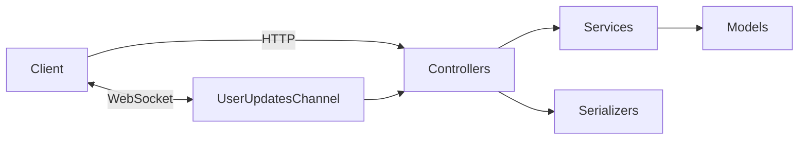

# Aetherium Ascent

Aetherium Ascent is a turn‑based resource and crafting game built with Ruby 3.4 and Rails 8.0, designed around a JSON API and a lightweight browser UI.

---

## Core Game Concepts

* **Actions** – user-triggered tasks that produce resources and can be upgraded
* **Resources** – consumable materials tied to actions and crafting recipes, each with a drop chance and base amount
* **Skills** – permanent upgrades purchased with skill points that modify action cooldowns or resource gains via strategy-style effect classes
* **Items** – inventory objects with one-off effects (e.g., reset cooldown) and drop probabilities
* **Crafting** – combines resources into items through recipes that specify required quantities
* **Buildings** – structures owned by users that can be upgraded for additional bonuses
* **Effects** – temporary modifiers stored in `active_effects` and applied via Action Cable updates

---

## System Architecture



* **Controllers** authenticate requests, delegate to services and render JSON through serializers
* **Services** house game logic (actions, crafting, skills, buildings, user init)
* **Action Cable** streams real‑time updates to clients (resources, items, skills, buildings)

---

## Data Models

| Model | Key Attributes | Associations |
|-------|----------------|--------------|
| **Action** | name, description, cooldown | has many resources, user_actions, effects |
| **Resource** | name, base_amount, drop_chance, action_id | belongs_to action; used in recipes and user_resources |
| **Item** | name, effect, drop_chance | has_one recipe; many effects; through user_items |
| **Recipe / RecipeResource** | item_id, quantity / component_type, component_id, quantity | recipe has many recipe_resources; each component can be a Resource or Item |
| **Skill** | name, cost, effect, multiplier | unlocked via user_skills |
| **Building** | name, description, level, effect | owned via user_buildings |
| **User** | email, level, experience, skill_points | has many resources, actions, skills, items, buildings, active_effects |
| **Join Tables** | user_actions, user_resources, user_items, user_skills, user_buildings track ownership and quantities |

---

## API Endpoints (JSON)

| Endpoint | Description |
|----------|-------------|
| `POST /api/v1/authenticate` – Obtain JWT token |
| `GET /api/v1/user` – Current user stats |
| `GET /api/v1/resources` – All resources for user |
| `GET /api/v1/user_resources` – Detailed user resource amounts |
| `GET/POST/PATCH /api/v1/actions` – List, perform, and upgrade actions |
| `GET/POST /api/v1/skills` – List and unlock skills |
| `GET/POST /api/v1/items`, `POST /api/v1/items/:id/use` – Inventory and item usage |
| `GET/POST /api/v1/crafting` – List and craft recipes |
| `GET/POST/PATCH /api/v1/buildings` – Manage buildings |

Authentication is required for all endpoints except registration and token issuance; clients send the token in the `Authorization` header. Tokens are decoded by the `Authenticable` concern using the `JsonWebToken` helper.

---

## Getting Started

1. **Ruby version** – Install Ruby 3.4.0 and Bundler
2. **Dependencies** – PostgreSQL, Node/JS runtime (for Rails), and gems from the Gemfile (`bundle install`)
3. **Configuration** – Set the `JWT_SECRET` environment variable (see "JWT Secret & .env" below)
4. **Database setup** – `bin/rails db:setup` or `bin/rails db:create db:migrate db:seed` (seeds create initial actions, resources, skills, items, recipes, buildings)
5. **Run the server** – `bin/rails server`; visit `/` for the demo UI or use the API directly.
6. **Run the test suite** – `bin/rails test` (Minitest with fixtures and mocha)
7. **Linting** – `bundle exec rubocop` (rails‑omakase rules)

---

## Services

* **ActionService** – validates cooldowns, rolls drops, applies skill effects and grants experience
* **SkillService** – unlocks skills and applies strategy-based effects to actions
* **CraftingService** – verifies resources and produces items while updating inventory
* **BuildingService** – constructs and upgrades user buildings (placeholder cost logic)
* **ItemService** – executes item effects (stubs for luck and cooldown)
* **UserInitializationService** – assigns starting resources and actions for new users

---

## Experimental Crafting (Preview)

This repo includes an experimental crafting mode that can be enabled per user to preview a next‑gen crafting flow while reusing the current implementation.

- What: `AdvancedCraftingService < CraftingService` is selected when `users.experimental_crafting` is true. For now it delegates to the base service, so behavior is identical; it exists to allow gradual feature rollout.
- Inventory quality: `user_items` has a `quality` column (default `normal`) with enum tiers declared in `UserItem`. The base service reads/writes at `quality = 'normal'`.

Enable locally
- Run migrations and seeds: `bin/rails db:migrate db:seed`
- Toggle the flag for a user (Rails console):
  - `u = User.find(1)`
  - `u.update!(experimental_crafting: true)`
- Crafting calls for that user will route through `AdvancedCraftingService`.

Planned follow‑ups (no migration yet)
- Add a composite index on `user_items(user_id, item_id, quality)` to support fast lookups by quality and prepare for unique constraints per tier.
- Extend `AdvancedCraftingService` with quality rolls, partial/failure outcomes, and skill/tool/building modifiers.

---

## Content Seeding via YAML

Seeds are externalized to YAML files under `db/data`. This makes it easy to add and edit world content without touching Ruby code.

- Files: `db/data/actions.yml`, `resources.yml`, `skills.yml`, `items.yml`, `buildings.yml`, `recipes.yml`, `flags.yml`.
- Apply: `bin/rails db:seed` (idempotent upserts; no user-owned data is modified).
- Dry-run: `DRY_RUN=1 bin/rails db:seed` or `bin/rails seeds:dry_run`.
- Plan: `bin/rails seeds:plan` prints effective packs, source files, and planned row counts (no writes).
- Lint: `bin/rails seeds:lint` checks basic shapes and references.
- Prune: `PRUNE=1` will remove recipe components that aren’t listed in YAML.
- Packs: set `PACKS=woodworking,alchemy` to merge themed packs from `db/data/packs` over core YAML. Use `PACKS=all` to include all packs. Use `EXCLUDE=pack1,pack2` or `EXCLUDE=all` to filter.

Action ordering
- Each Action can define an `order` in YAML. If omitted, an order is assigned automatically so you don’t need to hunt for the next number:
  - Core actions use the next value in a reserved core block; each pack gets its own block.
  - Values increment by 10 to allow manual inserts later without renumbering.
- The API returns actions sorted by `order` then `name` to keep the UI stable.

Notes
- Recipes reference components by `type` (`Resource` or `Item`) and `name`.
- Flags support `requirements` (with `type`, `name`, `quantity`, `logic`) and `unlockables` (`type`, `name`).
- After changing content, consider running the ensure tasks to backfill user associations.

See also
- `SEEDS_REFERENCE_GUIDE.md` for detailed guidance, workflows, and flag examples.

Starter packs
- You can organize themed “starter packs” of content under `db/data/packs/<pack_name>/` (e.g., woodworking, alchemy) with the same YAML shapes as core.
- Load packs via `PACKS=woodworking,alchemy bin/rails db:seed` to merge them on top of core content.
- Details and a sample woodworking pack are in `SEEDS_REFERENCE_GUIDE.md`.

---

## Dismantling (Items)

You can dismantle items into their component outputs using rules defined in YAML and executed by a service.

- Data: `db/data/dismantle.yml` (item-only for now) defines per-item outputs with optional salvage rates.
- Service: `DismantleService#dismantle_item(item_id, quality: 'normal')` decrements one item and grants outputs transactionally.
- API: `POST /api/v1/dismantle` with `item_id` and optional `quality`.
- Broadcasts: item/resource deltas are pushed via `UserUpdatesChannel`.

Deterministic yields
- Each yield computes `floor(quantity * salvage_rate)`; 0 means no output. Skills/modifiers can be added later to adjust salvage rates.

Example `db/data/dismantle.yml`
```
- subject_type: Item
  subject_name: Hatchet
  yields:
    - { type: Item, name: Twine, quantity: 1, salvage_rate: 0.8 }
    - { type: Resource, name: Stone, quantity: 5, salvage_rate: 0.6 }
```

---

## Adding a New Game Element

Use the following checklists when introducing new content. Most data lives in `db/seeds.rb`, but remember to write tests for any new logic.

### Actions
1. **Seed the action** – add an `Action.create!` entry in `db/seeds.rb` with `name`, `description` and `cooldown`.
2. **Seed produced resources** – create `Resource` records for any drops and associate them via `action.resources <<` or by setting `action_id`.
3. **Initial user access** – if new users should start with the action, add it to `UserInitializationService`.
4. **Front‑end** – expose the action in the relevant view or API response.

### Resources
1. **Seed the resource** – create a record with `name`, `base_amount` and `drop_chance`; set `action_id` if gathered from an action.
2. **Wire into recipes** – update `RecipeResource` entries that should consume this resource as components.
3. **Broadcast updates** – ensure resources are streamed through `UserUpdatesChannel` if they affect real‑time data.

### Items
1. **Seed the item** – add a new `Item.create!` block to `db/seeds.rb`.
2. **Define the crafting recipe** – create a `Recipe` for the item and one or more `RecipeResource` entries specifying required components (Resources or Items).
3. **Implement item effect** – extend `ItemService` with logic for the item’s effect (e.g., cooldown reset). Create an effect class if needed.
4. **Expose via API/UI** – update serializers and views so players can craft and use the item.

### Skills
1. **Seed the skill** – add a `Skill` record with `cost`, `effect` and `multiplier`.
2. **Implement effect class** – create a class under `app/services/skill_effects/` implementing the desired behavior.
3. **Register the effect** – map the skill’s `effect` attribute to the new class in `SkillService`.
4. **Test unlocking** – add service tests to verify the skill works and interacts with actions as expected.

### Effects
1. **Seed the effect** – create an `Effect` record with `name`, `description` and `duration`.
2. **Effect logic** – implement the effect in an item or skill service, or create a dedicated effect class if complex.
3. **Apply to users** – ensure the effect is added to `ActiveEffect` when triggered and removed after expiration.

### Buildings
1. **Seed the building** – add a `Building` record with `cost` and any stat bonuses.
2. **Service logic** – extend `BuildingService` to handle construction or level upgrades and their effects.
3. **Initial state** – grant starting buildings in `UserInitializationService` if appropriate.
4. **Expose in UI** – update views/serializers and broadcast changes to users.

### Crafting & Recipes
1. **Recipe setup** – create the `Recipe` and associated `RecipeResource` records that define input components and quantities.
2. **Item availability** – ensure the crafted item exists and is referenced by the recipe.
3. **Service updates** – add any new crafting validations or outcomes to `CraftingService`.
4. **Testing** – write unit tests for crafting the new recipe and confirm the item appears in inventories.

---

## Deployment

* Standard Rails deployment (e.g., `bin/rails server` or containerized).
* Kamal/Docker support is available through the provided `Dockerfile` and `kamal` gem for container builds and deploys.

---

## Additional Onboarding Notes

* **Code Style** – RuboCop Rails Omakase is the canonical style; run `bundle exec rubocop` before committing.
* **Testing Philosophy** – Use fixtures and service/controller tests to cover new logic; mocha is available for mocking.
* **Seeding Data** – `db/seeds.rb` provides a rich set of starter data for dev environments.
* **Game Loop** – Perform actions → gather resources → craft items → unlock skills/buildings → stronger actions, with experience leading to level-ups.
* **Real‑time Updates** – Client subscribes to `UserUpdatesChannel` using JWT token; server pushes resource, item, skill and building changes instantly.
* **Authentication** – Devise handles registration; JWT tokens authenticate API/WebSocket requests via the `Authenticable` concern and `JsonWebToken` utility.

---

## JWT Secret & .env

- **What:** The app signs and verifies JWTs with a secret read from `ENV['JWT_SECRET']` (see `config/application.rb`).
- **Where:** Provide it via your environment in production and locally via a shell-exported `.env` file.

### Generate a strong secret
- OpenSSL: `openssl rand -hex 64`
- Ruby: `ruby -rsecurerandom -e 'puts SecureRandom.hex(64)'`

### Create a `.env` file (development)
- Location: project root (same folder as `Gemfile`)
- Contents (key=value, one per line):
  - `export JWT_SECRET=your_long_random_hex_string_here`

Alternatively, copy the template and edit:
- `cp .env.example .env` and fill in the values.

### Load the `.env` into your shell session
- Bash/Zsh (export all keys from `.env`):
  - `set -a; source .env; set +a`
- Verify: `echo $JWT_SECRET` prints your value

Notes
- `.env` is ignored by Git (`.gitignore`). Do not commit secrets.
- Set real environment variables in production (Heroku, Render, Fly, Docker/Kamal, etc.) rather than using `.env`.
* **Future Roadmap** – expand effect classes, implement item logic, add balancing (resource costs, skill multipliers) and flesh out building effects.

---

## Gotchas & Common Pitfalls

* Fixtures are tightly linked; modify them carefully to avoid cascading test failures.
* Never edit existing migrations—create new ones to evolve the schema.
* Ensure cooldown and drop-chance logic is deterministic in tests (use mocking/stubbing).
* Remember to broadcast changes when adding features that affect client state.

---

Happy hacking, and welcome to the ascent!
