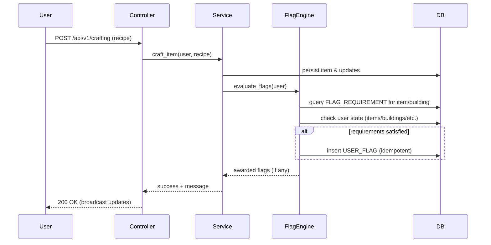
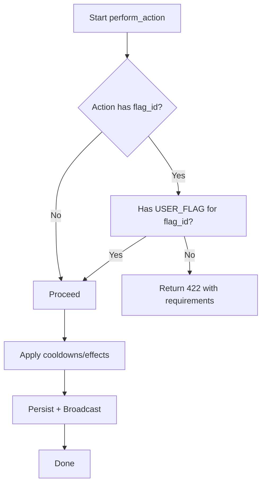
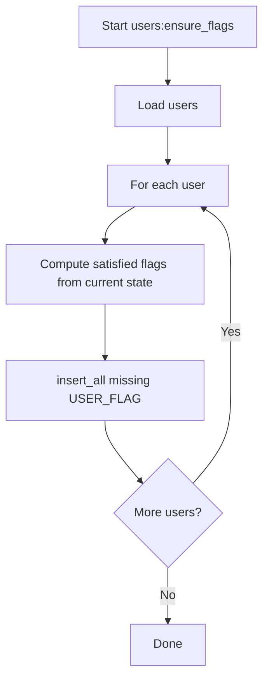

# Feature Flags – Visual Diagrams

These Mermaid diagrams visualize the two schema options and key flows from `feature_flag_spike`.

## Schema – Simple (per-model `flag_id`)

PNG: docs/feature_flags/diagrams/schema_simple.png

```mermaid
erDiagram
  USER ||--o{ USER_FLAG : "has"
  FLAG ||--o{ USER_FLAG : "granted for user"
  FLAG ||--o{ FLAG_REQUIREMENT : "has requirements"

  USER {
    bigint id PK
    ...
  }

  FLAG {
    bigint id PK
    string name
    string slug UNIQUE
    text description
  }

  USER_FLAG {
    bigint id PK
    bigint user_id FK
    bigint flag_id FK
    UNIQUE user_id, flag_id
  }

  FLAG_REQUIREMENT {
    bigint id PK
    bigint flag_id FK
    string requirement_type  "Resource|Item|Building|Flag|Skill"
    bigint requirement_id
    integer quantity
  }

  %% Unlockables each get an optional flag_id
  ACTION {
    bigint id PK
    string name
    bigint flag_id FK "nullable gate"
  }

  ITEM {
    bigint id PK
    string name
    bigint flag_id FK "nullable gate"
  }

  SKILL {
    bigint id PK
    string name
    bigint flag_id FK "nullable gate"
  }

  BUILDING {
    bigint id PK
    string name
    bigint flag_id FK "nullable gate"
  }

  RECIPE {
    bigint id PK
    string name
    bigint flag_id FK "nullable gate"
  }
```

## Schema – Flexible (polymorphic `unlockables` join)

PNG: docs/feature_flags/diagrams/schema_flexible.png

```mermaid
erDiagram
  USER ||--o{ USER_FLAG : "has"
  FLAG ||--o{ USER_FLAG : "granted for user"
  FLAG ||--o{ FLAG_REQUIREMENT : "has requirements"
  FLAG ||--o{ UNLOCKABLE : "gates"

  UNLOCKABLE {
    bigint id PK
    bigint flag_id FK
    string unlockable_type "Action|Item|Skill|Building|Recipe"
    bigint unlockable_id
    UNIQUE flag_id, unlockable_type, unlockable_id
  }

  %% Domain models stay clean (no flag_id column needed)
  ACTION {
    bigint id PK
    string name
  }
  ITEM { bigint id PK }
  SKILL { bigint id PK }
  BUILDING { bigint id PK }
  RECIPE { bigint id PK }
```

## Flow – Award flags on craft/build

PNG: docs/feature_flags/diagrams/flow_award_sequence.png



## Flow – Enforce before using gated Action

PNG: docs/feature_flags/diagrams/flow_enforce_flowchart.png



## Flow – Backfill ensure flags

PNG: docs/feature_flags/diagrams/flow_backfill_flowchart.png



Tips
- Pick Simple for speed-to-ship; pick Flexible for multi-model reuse and minimal schema churn.
- Show requirements in UI from `FLAG_REQUIREMENT` so users know how to unlock.
- Keep `users:ensure_flags` idempotent and fast via `insert_all` and proper indexes.
